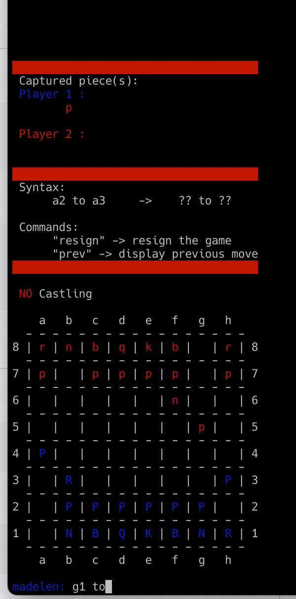

# TUI Chess

This is my final project for the C++ Data Structure course (2016).



## Installation

To get started, clone the repository:

``` bash
$ git clone https://github.com/rolemadelen/chess
$ cd chess
```

Compile the `.cpp` files and run the executable:

```bash
$ cd source
$ g++ -o chess *.cpp
$ ./chess
```

## How to play

To make a move, use the following syntax to move a piece from one position to another:

```text
Player1: [src] to [dest]
```

For example, if _Player1_ wants to move a pawn located at _b2_ to _b4_, enter the following command:

```text
Player1: b2 to b4
```

## Commands

The following commands are available during the game:

- `resign`: End the game and resign.
- `prev`: Display the previously made move (or the opponent's move).
